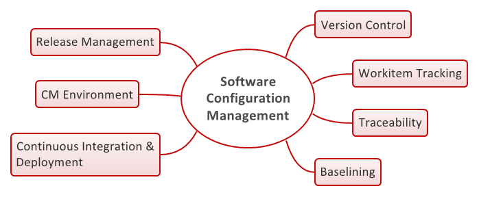

## A Central Software Engineering Skill

Configuration management is a necessary means and skill that allows entire teams of software engineers to create and maintain software systems throughout its lifetime. It can regulage who has access to certain parts of a project.  Configuration management also keeps track of all the changes and versions of a project, which is great for retracing steps in the event that a bug or error is introduced in a newer implementation of a project. Additionally, configuration management makes it possible to regulate the released versions of a software or project. Without configuration management, it would be difficult for a many developers or subsidiary teams of developers to work on a project without possibly encountering issues with file versions or unintentional overwrites.

## My Thoughts on Configuration Management

As of the moment I am writing this, my experiences with collaborative software development have been limited.  Because of this, I have yet to encounter a problem that is likely to arrise due to the absence of  configuration management practices.  An example of this could be lack of access control, which can lead to disruptions in proper implementations for certain components in a project. Even though my exposure to team projects has been limited, I certainly see it as a useful tool and look forward to using it more in the future.

## Git & GitHub

Git is a version control system, which tracks the changes in computer files that may or may not have been made by multiple people.  It is currently the most popular technology for configuration management.  GitHub, on the other hand, is a web-based version of Git, and is currently the most popular cloud-based software hosting platform for configuration management.  It is difficult to decide whether GitHub is popular because of Git or that Git is popular because of GitHub.  Git was initially released in 2005, and its original author was none other than Linus Torvalds, the principal developer of Linux systems. It is plausible that Git is popular because of its original author. GitHub was later made available in 2008. It is possible to say that it is also popular because of the origins of Git; however, putting this aside, the concept and accesibility that GitHub brings to the table for developers provides grounds for one to say that Git is popular because of GitHub, or because it is web-based. One can say that GitHub made Git popular not just because of who made it, but because it grants more flexibility and usefulness by being a cloud-based version of Git.  I simply cannot choose one speculation over the other; thus, I believe that Git and GitHub make each other popular.

