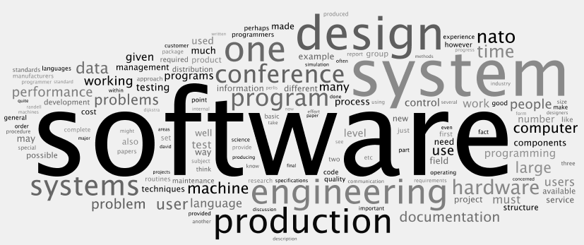

I was born in the age of technology.  I was fortunate to be able to grow up while being able to learn how to use computers and other technologies as a child.  I was also fortunate to have such technologies in the form of conveniences like cell phones, and entertainment like video games.  Today, computers run the world, and many things are becoming digital. Such exposure has lead me to an interest in computer science.

It is to my understanding that technology has become an integral part of our society today.  Many businesses and organizations depend on technology in order to run and provide their respective services.  Today, one of the most prevalent concerns in the cyber world that affects many people is cybersecurity.  My main interests in computer science are within this scope of information and computer science.

In the future, I hope be employed in a career related to cybersecurity or cryptography.  As I write this; however, I know that my skills in software engineering are lacking.  They are particularly lacking in terms of coding at a proficient and efficient rate.  With that said, I hope that by taking Dr. Johnson’s Software Engineering course, which utilizes an athletic approach to software engineering, I can become a better programmer so that I can be a part of securing the cyber world.

