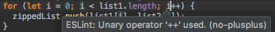

## Rules for a Language

If there were no rules to writing English, what would happen?  Perhaps some would write like this.  0r LiKE tHI$.  OrRrr maaa@ayyyybbeeeeee lieekkkeee thiiiiissss.  Without rules for writing English, people would just write however they may want to, and it would thereby be difficult for people to effectively communicate with one another because the lack of consistency can create confusion and misunderstandings.  This can generally lead to other issues and be inefficient too.  Rules like those pertaining to grammar and spelling are standards for writing English, and they are necessary for the sake of clarity and universal understanding.

## Coding Standards

Coding standards for a programming language have guidelines for the general style by which one should write code, practices one should follow, and methods one should use when writing code.  Such guidelines may include rules with regards to conventions such as commenting, naming conventions, whitespace, indentation, et cetera. 

Similar to how grammar and spelling rules are needed for writing in English, coding standards are useful for writing in programming languages as well.  Adherence to coding standards when programming creates consistency that makes for readability. This is particularly true when writing source code as part of a team or for a client.  Different programmers may have an inclination to write code according to the conventions and standards of a programming language that they are accustomed to, and various programming languages have different coding standards.  If such programmers needed to work together using a language that they be more or less familiar with, the use of coding standards is necessary.  By writing in accordance to a standard, others are more likely able to understand what one has written, which is useful in the event that peer reviews for debugging is needed.  In addition to being useful for readability, following coding standards may simply yield code that is more efficient and reliable. 

## Linting for Success

Coding standards can be established in plain English, but it can be difficult for one to follow them properly, especially if he or she usually writes programs in different languages on a regular basis.  In order to combat this, the use of linting tools can help one keep track of whether or not any written code adheres to a particular coding standard.  Code linting is a type of static analysis that identifies errors in code or when it does not satisfy certain rules. Linting utilities can not only identify potential problems in code, but also offer some suggestions on how to resolve it. 

## My Experience with ESLint for JavaScript

An example of a linting utility is ESLint, which is intended for JavaScript.  I have personally used ESLint as a plugin linting tool in the IntelliJ IDEA integrated development environment and found it to be useful in a way where it not only corrects my coding mistakes, but also helps me with learning how to write code in JavaScript.

When all is good in a given piece of code, a green checkmark is displayed; otherwise, red marks indicating an error or unsatisfactory element in the code will appear.  During one of my experiences with using ESLint for JavaScript, I encountered a red flag and an indication of following error:




This piece of code worked, but did not adhere to the coding standards that I applied to it.  In this case, ESLint flagged the use of '++'.  With further investigation, I found that ESLint has a [rule](http://http://eslint.org/docs/rules/no-plusplus), which disallows the use of unary operators such as '++' and '--'.  When I learned of this, I made the following adjustments in order to satisfy the standard:

```javascript
for (let i = 0; i < list1.length; i++) //before
for (let i = 0; i < list1.length; i += 1) //after
```

Upon making these changes, a green checkmark appeared and granted me relief. Overall, this experience helped me realize that my understanding of how code should be written could be outdated or inadequate altogether.  At any rate, I found ESLint to be useful.  As such, I will probably continue to use linting tools in order to properly follow a set of coding standards for any giving programming language and produce code that executes well and offers great readability.