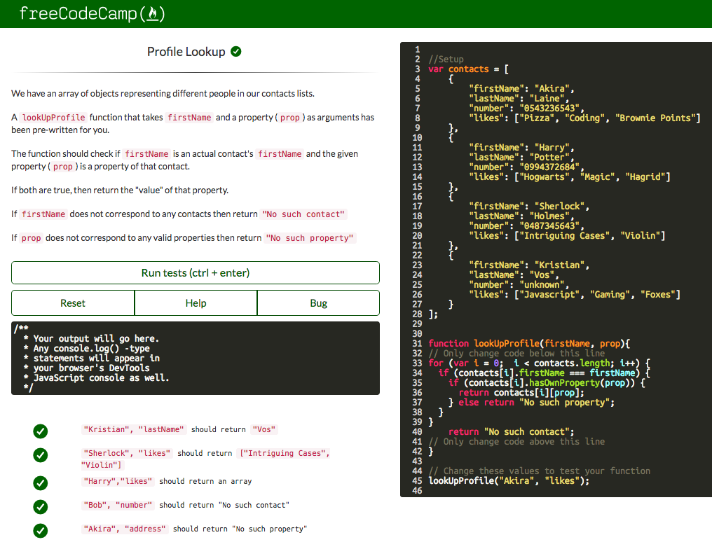

## Initial Thoughts on JavaScript

At the time I am writing this, JavaScript is completely new to me. Based on my limited experience with it so far, it seems syntactically easy to understand and write.  Because of this, I can roughly say that JavaScript may be a good programming language in terms of ease of implementation, from a software engineering perspective.  JavaScript also seems similar yet also easier to write than other programming languages like Java.  I had my first experience with JavaScript by completing the [Basic JavaScript exercises on freeCodeCamp](https://www.freecodecamp.com/map-aside#nested-collapseBasicJavaScript).  Completing these exercises not only taught me a bit of elementary JavaScript, but also helped to refresh my memory on how to write code in general.



## Athletic Software Engineering

My Software Engineering course teaches JavaScript through the method of ‘athletic software engineering’.  This course involves short coding exercises called WODs, and a WOD is a ‘workout of the day’.  Each week, two WODs are assigned as homework.  A practice WOD is also administered in class on Tuesdays.  For more practice, students have an opportunity to attend a WOD session hosted by our TA, Amy, and this session is called an Amy WOD.  The practice WODs are intended to prepare us for the ‘real’ WOD, which takes place each Thursday.  In short, students are required to do many short coding exercises, but what makes it ‘athletic’ or a ‘workout’?  WODs are actually timed coding exercises that are intended to get students acclimated to the stress and real-world demands of being able to understand a problem and write accurate code within a reasonably short amount of time.

To gain more practice in my first week of experiencing WODs, I went to an Amy WOD.  I plan to continue to attend Amy WODs every week to get more practice.  Here is a link that describes the problem presented by my first [Amy WOD called Suzuki’s Stairs](http://courses.ics.hawaii.edu/ics314f16/morea/javascript-1/amywod-stairs.html).  Here is my solution to this WOD:

```
function suzukiStairs(arr) {
  let daySum = 0;
  let dayAvg = 0;
  let weekAvg = 0;
  let yearAvg = 0;

  for (i = 0; i < arr.length; i++) {
    for (j = 0; j < arr[i].length; j++) {
      daySum += arr[i][j];
    }
    dayAvg = daySum / arr[i].length;
    weekAvg += dayAvg;
    daySum = 0;
  }
  yearAvg = weekAvg * 52;
  return yearAvg;
}

console.log(suzukiStairs([
  [23, 25, 32],
  [4, 2],
  [1, 1, 1, 3],
  [15, 18, 19],
  [2],
  [31],
  [11, 13, 9]
]))
```

I find WODs to be a pretty effective method to learn how to code efficiently and practically.  I think WODs are a great way to practice for interviews related to software engineering where similar problems may be asked.  They encourage students to analyze and solve problems quickly, which is something that I know I need to work on.  

Although I view WODs as being potentially beneficial to my learning experience, I also find it to be quite stressful.  Even though I seem to do well on the practice WODs that are assigned for homework, I tend to get overwhelmed with stress and anxiety when it comes to doing them and performing in class.  I recognize that this is obviously a great weakness that must be corrected if I ever want to pursue and succeed in a career related to software engineering.  With that said, I am not quite sure that WODs will work for me, but I hope that with enough exposure and practice, I will not feel as stressed and instead become much more proficient at programming than I have ever been. 
