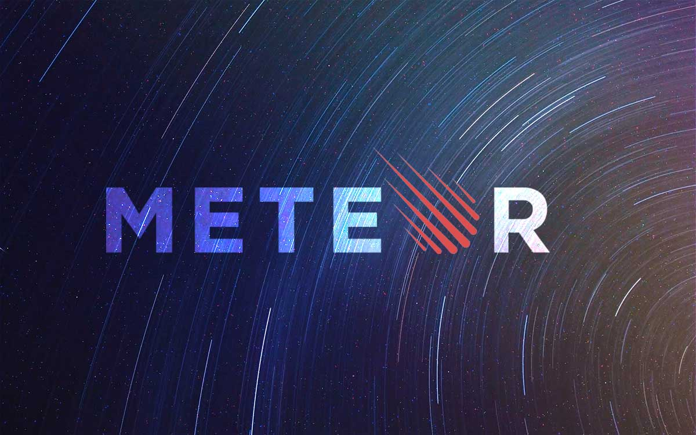
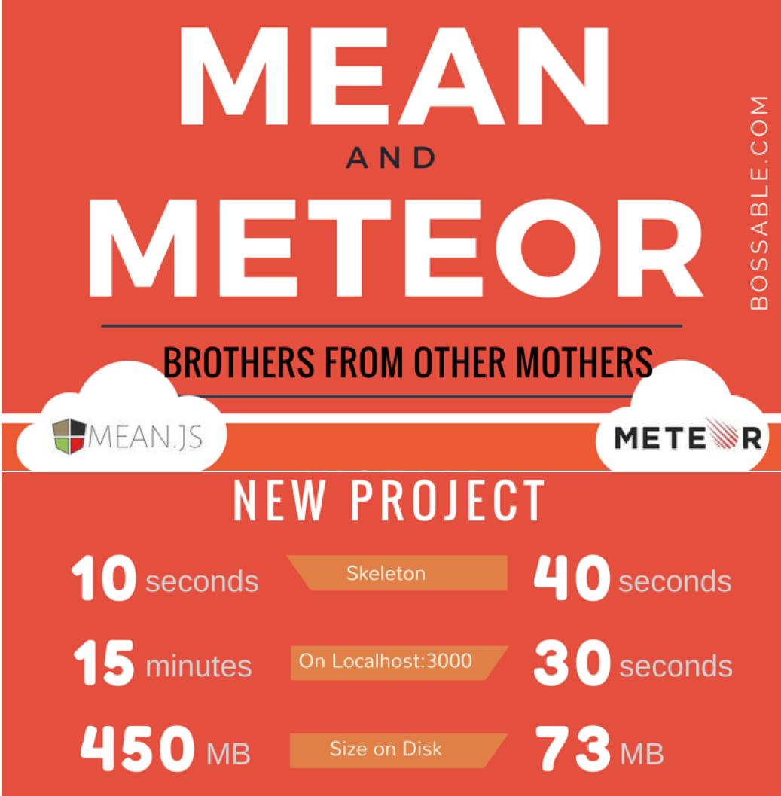

## The Universe of Web Development

For some, understanding and learning about web development could be as complex as learning about outer space, but it can be roughly described in simple terms as such: when people look at a website or web application, what they see in aesthetic sense is the product of its *front-end development*.  It's functionality in terms of how it would store, retrieve and manipulate any requested information is made possible by the *back-end development*.  Together, the front-end and back-end make what's known as a full-stack or a collection of different layers that simply make websites and web applications work.  The programming languages used at each end may differ.  For example, the back-end or server-side of a stack would run on scripting languages like Java, PHP, Python or Ruby, to name a few.  Browser-based front-end languages include but are not limited to HTML, JavaScript and CSS.  In short, if you want to make and deploy websites or web applications, you need to know all these languages and know how they all come together right? Wrong.  Or at least, not necessarily. 

## Simplifying Rocket Science

Emerging as one of the most popular web stacks today is the *MEAN* stack, which allows one to use JavaScript for *both* the front- and back-end development.  For beginners of web development who may not have a deep understanding of many programming languages like myself, this means that creating functional and visually appealing web products and services doesn't have to feel like solving rocket science. As a faster, simpler and more seamless alternative to the MEAN stack, there's [*Meteor*](http://meteor.com/), which is said to be relatively easy to learn and great for rapid application development.  

## Flying at the Speed of Light

Not surprisingly, my first experience with full-stack web development was made possible through Meteor.  Based on my initial experiences with it, I can vouch for it's relative simplicity because I was able to learn about enough of it to be able to launch a working product within a matter of a couple weeks.  This is particularly amazing for me personally because I know that at the time of writing this, I have much to learn in the realm of programming and am by no means a programming-genius.  

# Meteor Magic

Although learning how to use Meteor is said to be relatively simple, for me, doing so was not without difficulty.  It was challenging, but not too challenging, yet also interesting.  Using templates and APIs, among other components to populate a page with an entire collection of items seemed magical.  To me, Meteor makes sense and was not too terribly difficult to understand.  

# Blazed by Meteor

The difficulties that may come hand in hand with using Meteor are not limited to programming-related knowledge, but its installation as well.  By observing others' experiences with learning Meteor, I found that its installation can be frustrating.  This seemed to be the case for users of operating systems like Linux and Windows in particular--especially for those who used versions of Windows that weren't at least Windows 10.  Fortunately for me, I had almost no issues with installing Meteor and its dependencies because it is very UNIX-friendly.  With that said, I used Meteor on a UNIX system, or macOS on a MacBook Pro, to be precise.  For those who don't know though, Apple's laptop products tend to be behind the curve when in terms of coming with the latest RAM hardware out of the box unless wants to spend an extra pretty penny for more processing power.  As shown by the image above, the initial creation of a Meteor application should be relatively quick, but this was painfully not the case for me.  The initial creating of a Meteor application was extremely slow on the hardware that I had.  I found that Meteor requires a lot of RAM, or at least 16GB of it, which again, is not the out-of-the box standard for recent to somewhat older MacBook Pros.  To deal with this and be able to develop using a more fluid environment, I bit the bullet and got my hands on another computer.

# I Love it to the Moon and Back

As previously mentioned, I was able to learn and understand Meteor enough to make something functional relatively quickly.  Because of this, I was actually able to participate in AT&T's Hawaii Hackathon of 2017 spontaneously too, which I really enjoyed.  Overall, I look forward to learning more and improving my skills in Meteor and having fun by creating better products in the future.  