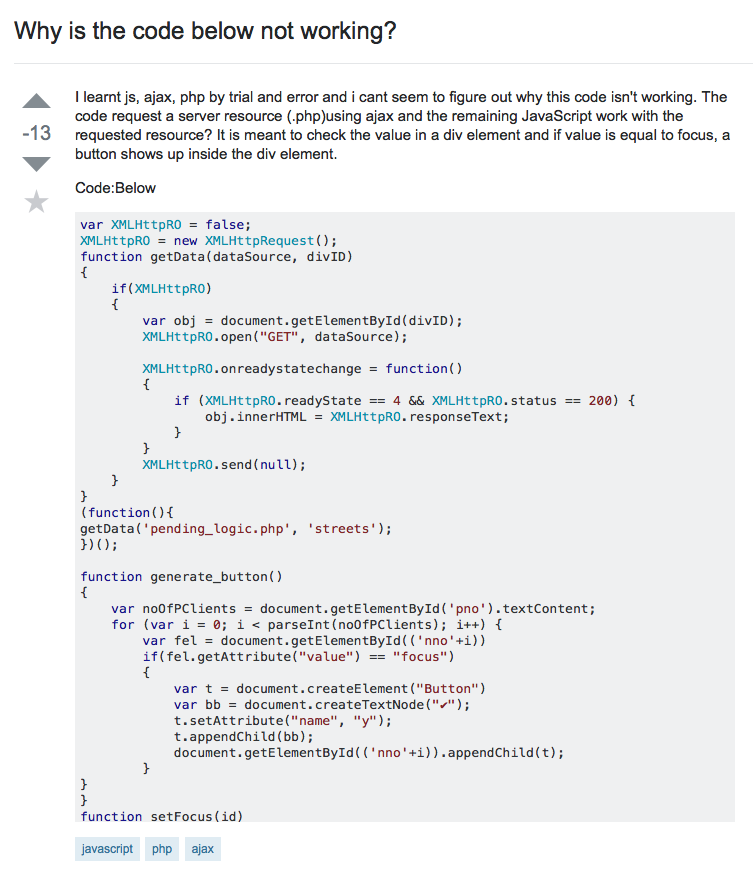

## Learning From Others

No human being can stand to develop, improve, and solve all problems solely on their own. Instead, we often require further insight and knowledge from other people in order to become more learned in any subject and find solutions to various problems.  This idea is especially true for software engineers or programmers, and it is not limited to those whose programming skills are elementary at best.  At some point and time, a software engineer may have trouble with trying to find a bug or resolve a problem in his or her software, or a student aspiring to be a software engineer may not quite understand how to properly apply a certain method to his or her code.  In any case, an individual who is met with similar circumstances should seek help from others.  One of the most valuable skills one can have, as a simple human and a software engineer, is the ability to ask ‘smart questions’.

## Asking ‘Smart Questions’

“You reap what you sow” could not be a more fitting expression to describe why it is important for a software engineer or programmer to ask a ‘smart question’.  Simply put, a well-developed question is more likely to receive a well-developed or satisfying answer.  This holds true in technical forums like Stack Overflow, which is a great place to ask questions and find answers related to programming.  Forums like Stack Overflow are filled with an abundance of questions that remain unanswered.  It is safe to assume that those who are best-able to answer any given question are busy.  Thus, for one to distinguish his or her own question among others, the question must be written in a way that deserves to be considered, given time to, or viewed upon at all. 

## ‘Smart Questions’ vs. ‘Stupid Questions’

People are more likely to respond to questions that are intelligible.   This means that any questions asked in forums or in mailing lists should be written with the proper use of spelling and grammar.  Questions that lack this tend to be ignored.  Intelligible questions also include explanations that reflect that the inquirer has already tried and/or researched various solutions.  People are also generally more inclined to help those who help themselves—or at least try to.  If a question brazenly displays a lack of effort in self-sufficient resolution, it may receive negative or unhelpful responses in place of desirable ones.  Furthermore, smart questions are also written politely.  A person should not ask a question that makes one seem entitled to an answer—because no one is; instead, questions should be asked with a tone of humility, and if a question is resolved or responded to, the inquirer should express his or her gratitude.  An example of a ‘smart question’ can be found [here](http://stackoverflow.com/questions/11227809/why-is-it-faster-to-process-a-sorted-array-than-an-unsorted-array).

## !Smart

A perfect example of why a software developer should not ask a ‘stupid question’ can be found [here](http://stackoverflow.com/questions/37880319/why-is-the-code-below-not-working).  

This question is extremely underdeveloped, as the inquirer made the fatal mistake of asking a very general or unspecific question: Why is the code below not working?  The inquirer did not show that he or she tried to find a solution before asking. He or she also failed to write this question with the inclusion of proper grammar and spelling.  Furthermore, he or she did not ask this question politely, and did not respond with a ‘thank you’ after receiving what seems like a valid response.  As a result, this question was returned with negative feedback such as down-votes, and a link to a guide on how to properly ask questions on Stack Overflow.  Responders also commented, asking for specific details on what the exact problem was.  Ultimately, one can see that unintelligible and lazy questions such as these are not returned with helpful answers; thus, it is in a software engineer’s best interest to ask ‘smart questions’.

For more information on how to ask smart questions, I highly recommend reading [this essay, written by Eric Raymond and Rick Moen](http://www.catb.org/esr/faqs/smart-questions.html).

