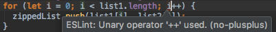

UI Frameworks are not simple. In fact, they can be almost as complicated to learn as a new programming language. Given that, why bother to use something like Semantic UI? What does one get in return for the investment of time and frustration? Why not just use raw HTML and CSS? Are the software engineering benefits of UI frameworks?

## Getting Started \[and Baffled\] with HTML and CSS

Learning a new programming language can be complicated frustrating. In the case of using HTML and CSS to create a web-page, one may find his or herself particularly frustrated due to a lack of skills in visual design.  However, the skills needed to use HTML and CSS are not simply limited to visual design.  It is also the art of manipulating the raw syntax of HTML and CSS to manually create each and every design element and put them together in an aesthetically appealing way.  Whether or not a person has these skills, using them to achieve the creation of clean and uniform web-pages can take a lot of time.  For anyone who falls in either category or shares these feelings, there is a solution, and that is to use a front-end development framework.

## Front-end Development Frameworks

*Front-end* as opposed to *back-end* refers to what one can see and actually interact with, so web development falls within this category.  A *framework* is a standardized set of concepts or solutions to certain problems.  In terms of web-design, a framework is a structured package of files, which includes codes that address or handle commonly needed implementations or formats. 


The most popular front-end development framework to date is [*Bootstrap*](http://getbootstrap.com/), which was developed by Twitter.  Second to Bootstrap
is [*Semantic UI*](http://semantic-ui.com/).  Those beginning to use HTML and CSS may find Semantic UI appealing because is uses natural language, which makes it easy to use.

```html


```

## Header

An example of a linting utility is ESLint, which is intended for JavaScript.  I have personally used ESLint as a plugin linting tool in the IntelliJ IDEA integrated development environment and found it to be useful in a way where it not only corrects my coding mistakes, but also helps me with learning how to write better code in JavaScript.

When all is good in a given piece of code, a green check mark is displayed; otherwise, red marks indicating an error or unsatisfactory element in the code will appear.  During one of my experiences with using ESLint for JavaScript, I encountered a red flag and an indication of following error:




This piece of code worked, but did not adhere to the coding standards that I applied to it.  In this case, ESLint flagged the use of '++'.  With further investigation, I found that ESLint has a [rule](http://eslint.org/docs/rules/no-plusplus), which disallows the use of unary operators such as '++' and '- -' because inclusion of such operators makes for error-prone code.  When I learned of this, I made the following adjustments, changing (i++) to (i += 1) in order to satisfy the standard:

```javascript

```

Upon making these changes, a green check mark appeared and granted me relief because it meant that the code I produced had met the standards checked by ESLint. 

Overall, this experience helped me realize that my understanding of how code should be written could be outdated or inadequate altogether.  As a result of this experience, I found ESLint to be useful in checking for the use of correct and optimal code in JavaScript.  I will probably continue to use linting tools in order to properly follow a set of coding standards for any given programming language and produce code that executes well and offers great readability.