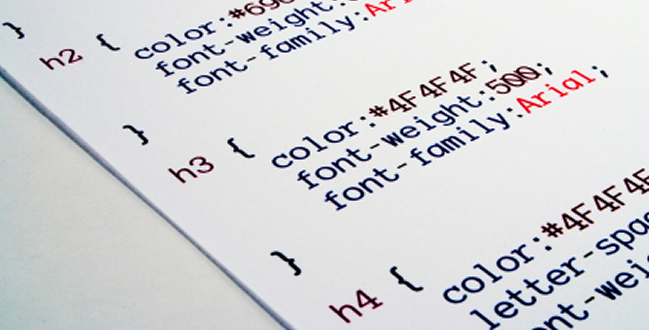
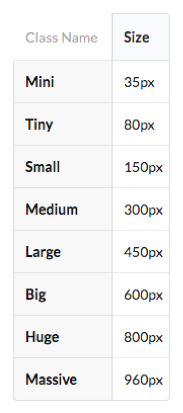

## Getting Started with HTML and CSS

Learning a new programming language can be complicated frustrating. In the case of using HTML and CSS to create a web-page, one may find his or herself particularly frustrated due to a lack of skills in visual design.  However, the skills needed to use HTML and CSS are not simply limited to visual design.  It is also the art of manipulating the raw syntax of HTML and CSS to manually create each and every design element and put them together in an aesthetically appealing way.  Whether or not a person has these skills, using them to achieve the creation of clean and uniform web-pages can take a lot of time.  For anyone who falls in either category or shares these feelings, there is a solution, and that is to use a front-end development framework.

## Front-end Development Frameworks

*Front-end* as opposed to *back-end* refers to what one can see and actually interact with, so web development falls within this category.  A *framework* is a standardized set of concepts or solutions to certain problems.  In terms of web-design, a framework is a structured package of files, which includes codes that address or handle commonly needed implementations or formats. 

## Easy-mode with Semantic UI


The most popular front-end development framework to date is [*Bootstrap*](http://getbootstrap.com/), which was developed by Twitter.  Second to Bootstrap is [*Semantic UI*](http://semantic-ui.com/).  Those beginning to use HTML and CSS may find Semantic UI appealing because is uses a natural language, which makes it easy to use.  



For example, instead of trying to figure out how many pixels wide an image should be set to, Semantic UI's class names such *big* or *small*, can be used to set an image to a general size.  In Semantic UI, these classes for sizes are predefined as shown in the table.

```html

```

```html


```

## Drawbacks of Semantic UI

While Semantic UI may be a great framework to use to make web design easy, it also has its own limitations. For instance, size classes in Semantic UI make it a little less complicated for one to set image sizes in a uniform manner, but what if you want to use a size that is not quite *big* or *large* and is instead something in between?  In such cases, one would be left to set the image size more manually with raw HTML/CSS.  In truth; however, I found that size variation classes can be marginally adjusted by adding *-er* to a size variation class.  For example, *large* can be *larger*, essentially making large images slightly larger than they would be if set to *large*.  Unfortunately, tweaks or pre-made applications like this are not exactly made available for all elements or variations across the board in Semantic UI.  Thus, Semantic UI or other similar frameworks may not work as desired if one aims to create more customized themes.  Nevertheless, front-end development frameworks like Semantic UI is a great medium for one to design web-pages with relative-ease or within a more than less reasonable amount of time.


