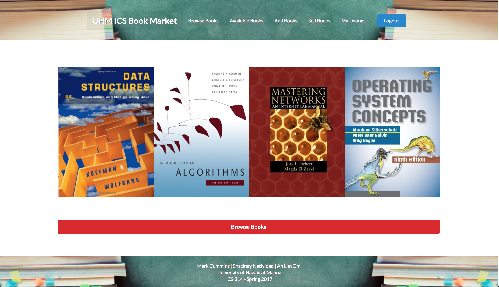
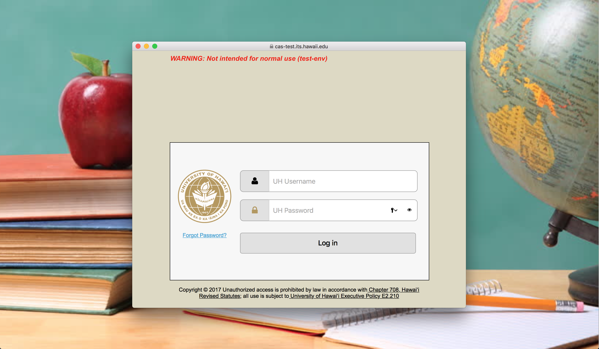
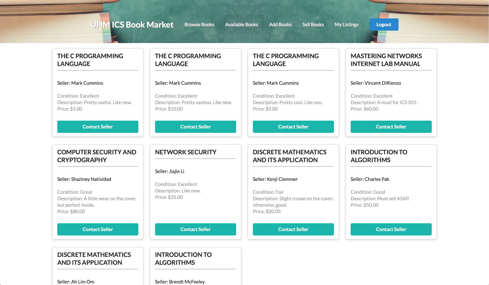

## Something for the Students of UH

Together with the help of two other developer partners, I created a book market web application as a final project for a software engineering course that I took at the University of Hawaii.  The intent behind this project was to develop something that could be useful and used exclusively by the students of the University of Hawaii.  With this in mind, my partner and I decided to make an application that could be used to buy and sell used textbooks amongst the students.  For the sake of simplicity, this application was scaled down and targeted at a smaller body of students: those of the Information and Computer Science Department.  The reason we decided to focus on this niche is to create this application as a sample.  If enough people found this to be useful, we may consider developing it further for the use and sales of books across all departments at the University of Hawaii.  

## My Contributions

My most notable contribution to this project might be the overall aesthetic design or look of the application. My other contributions to this application included the work behind the Landing, Login, Home and Available Books pages, in addition to the Header and Footer. Along with the image of the home page pictured above, these are images of the pages created by me:

#### Landing

*Upon entering the base web address, users are directed to this landing page.*

#### Login

*The login page utilizes the University of Hawaii's CAS system, which means only its students are able to use it.*

#### Home

*After logging in, authenticated users are redirected to the home page, which features a carousel of popular books.*

#### Available Books

*This page features all open listings of books up for sale.*

## Visions and Future Goals

There is definitely a lot more that we could do to improve the functionality of this application to enhance its intuitive user experience.  One thing we would like to implement is administrative features, so that the ability to add and remove a book from the overall collection of needed books is limited to administrators.  The addition of a "books wanted" page might be useful as well.  These are just a couple of things I personally hope to add to this application in the future as I improve my skills and knowledge in web application development.

## Development Details and Repository

You can check out [this website](https://icsbookmarket.github.io) to read more about the development of this project.  You can also see its repository on [GitHub](https://github.com/icsbookmarket/icsbookmarket).

##
