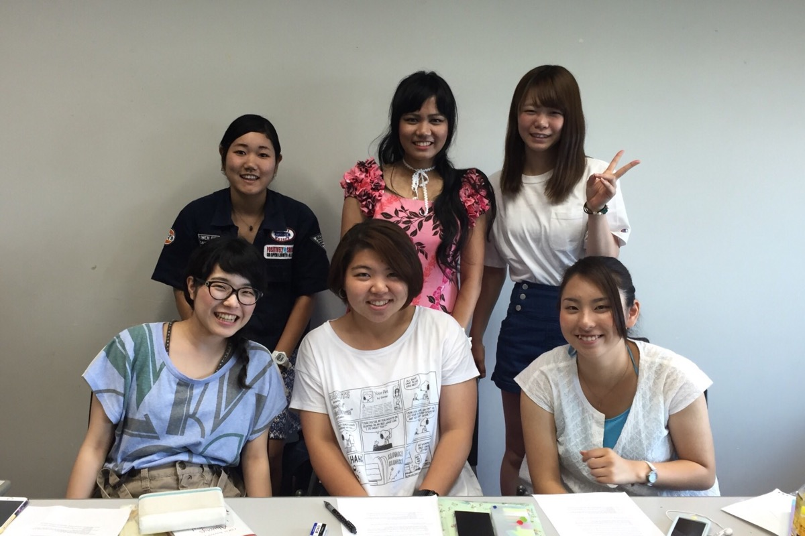
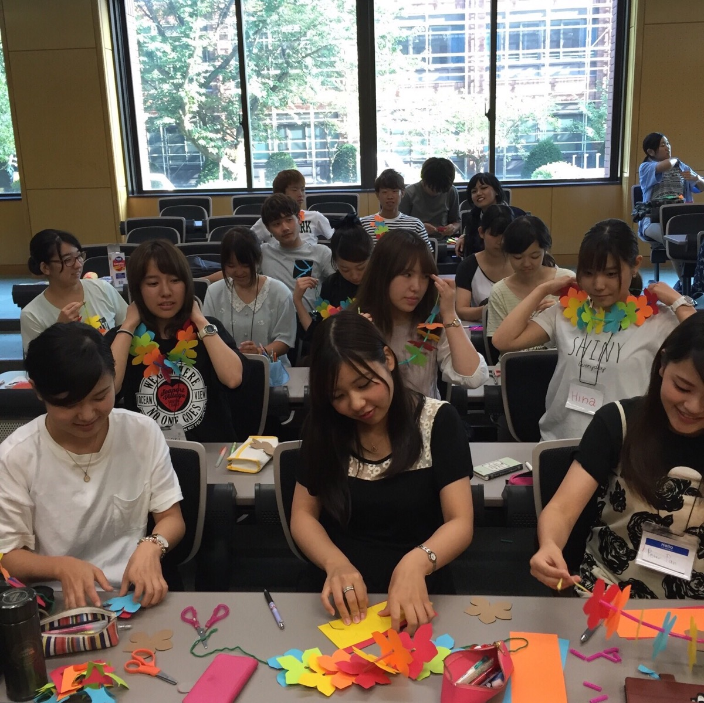
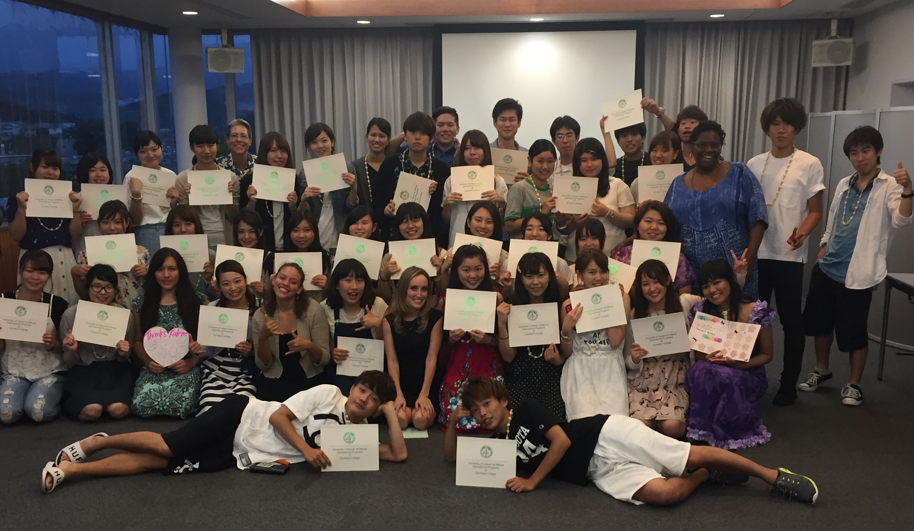

## Description

As part of my work as an Interchanger for the International Programs of the Outreach College of the University of Hawaii at Mānoa, I was selected to work as part of the Special English Program for Nihon University in Mishima, Shizuoka, Japan.  This program took place in the summer of 2016.  Other employees chosen to work for this program and myself worked together to prepare this educational program for a few months ahead of the program date.  A typical day in this program included English class time, program-wide English learning activities, and a period for interchange, which is a period where smaller groups of students are joined with an interchanger, such as myself, and given topics of discussion to be talked about or sometimes presented in English.

## Roles & Responsibilities

My primary role was to plan and deliver experiences that would allow Japanese students to learn and practice speaking English.  Prior to going to Japan, my co-workers and I had meetings to discuss our itinerary.  As an individual, I was responsible for researching and planning various learning activities to encourage and stimulate English speaking and listening. Together with my co-workers, we combined our classes and facilitated these activities in a large group, which made these activities quite fun for the students.  The purpose of this was to get students to get to know one another and build friendships so that they would feel comfortable enough to step outside of their comfort zone by not only practicing to listen to and understand others speak English, but also gain the courage to speak English frequently.  Sometimes a student learning English as a second language may refrain from speaking English due to fear of being wrong and feeling embarrassed because of it.  However, increased skill in speaking English comes from more frequent usage.  As such, I usually try to do everything I can to make all students feel comfortable and want to communicate in English.

In addition to planning and delivering activities, I assisted my partnered teacher with teaching our English class and lead interchange groups.  Assisting my partnered teacher often involved helping students with their in-class assignments.  During interchange sessions, I facilitated our English conversations in ways that were tailored to a student’s current level of understanding while still being thought provoking.  Once again, I also focused on creating a friendly, positive and dynamic atmosphere to lift the students’ anxieties and encourage them to participate.

Not-so-officially, I assumed the role of technical support for our Hawaii team of teachers, since I was pegged as the IT-go-to person by my boss because of my major.  We had to use some electronic equipment that appeared to be unique to Japan.  Some technical (and non-technical) issues were also resolved thanks to my skills in Japanese language.  I was also asked to produce videos for student presentations, their graduation ceremony, and promotion in the future.

## Learning Outcomes

My experience teaching in Japan was highly enjoyable.  I learned that even though it is not directly related to my field of studies, I would probably like teaching in Japan or perhaps teaching in general.  I was surprised to find that I know enough Japanese to possibly survive in Japan if I ever decided to live there.  Through this experience, I furthered my skills in planning, leadership, teamwork, teaching, communication, and Japanese language.  This experience also proved to me that pouring lots of consideration and effort into all tasks that culminate into a bigger task can yield extremely worthwhile results.  Many of my students were happy to learn from me, and expressed this in the form of lots of gifts and thank-you letters.  By then end of this program, I not only left with more globalized experiences and happy memories, but many, many new friends as well. 

