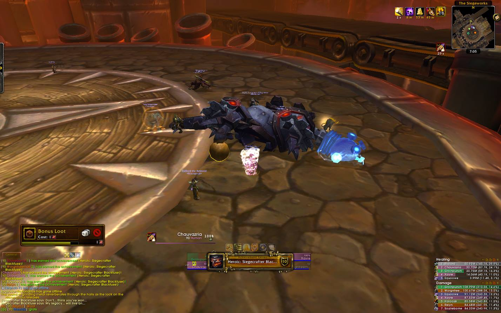
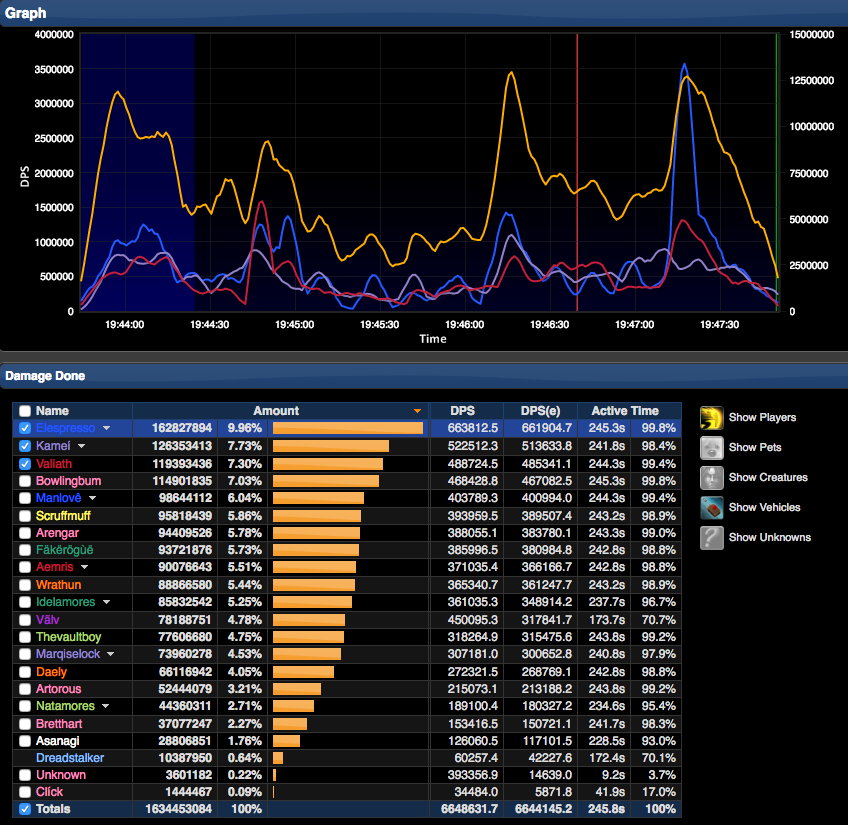
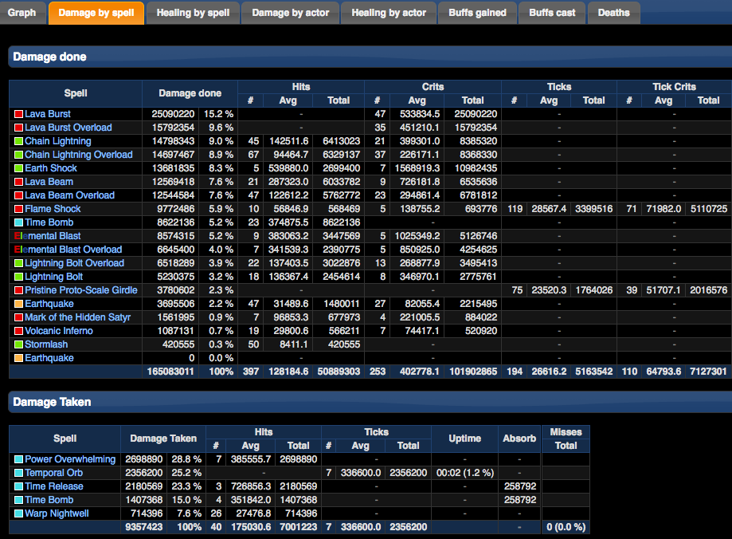

## Description

One of my previous pastimes was playing the popular massive multiplayer online role-playing game, *World of Warcraft*.  When I played, my main focus was in player versus environment gameplay, namely raiding, which is when a team of players work together to defeat challenging opponents or bosses.  There was a point and time when I went through a stringent hiring process to join a “server-first” raiding guild and became a regular member.  However, this guild eventually disbanded.  With my competitive nature and after having a taste of what it was like to be at the top, I became unsatisfied with simply playing “just for fun” or only to complete minor achievements.  Instead, I moved to a more competitive server in hopes of finding other skilled players and worked to create and lead a team that proceeded to achieve a highly ranked status within a top server or community, as well as the nation.

## Roles and Responsibilities:

### As a Guild Officer

My role in this endeavor was being an officer within a guild, as well as a raid leader.  As an officer, I sought to recruit skilled players that could fill unique roles that were needed by our guild’s progression raiding team.  Since raiding at a competitive level required lots of dedication and time (we raided for at least 20 hours a week on a scheduled basis), I did my best to find serious players who were committed and could perform well.  

To do so, I [advertised our roster needs on forums](https://us.battle.net/forums/en/wow/topic/4175830420#post-1) and on our website (which is no longer active), and required that interested players apply on our website.  Applicants that seemed promising were invited to our raids in order to exhibit and prove their skills and teamwork by working with us to defeat non-progression bosses or bosses that we already defeated and were no longer struggling to kill.  My criteria for decent players involved how well a player communicated with and worked with others, the damage or healing a player could produce and how much damage a player would take or be able to avoid.  Some of these criteria were carefully assessed by analyzing parses that recorded our performance.  

Additionally, in order to provide transparency and ensure that each member was aligned with our goals and motives, [I created an extensive policy](https://docs.google.com/document/d/1kZpz8wCGPn-zi_Hpa8vHn3U-LH9CXmNsshETHnmRiVI/edit?usp=sharing), which highlighted our expectations in terms of attendance and attitude, as well as other things such as how we distribute loot.

### As a Raid Leader

Apart from the recruitment process that I managed as an officer in my guild, I also acted as the raid leader.  To even begin to raid, I created weekly schedules based on the availability of our raid team members.  For the most part, the schedules were unchanged; however, in the event that occasional real-life events required the attention of any of our members, I communicated with other members to find ways to make up for lost time and potential progress to remain competitive by the means of rescheduling or temporary replacement.

Being a raid leader also meant that I actually had to lead the raid. In order to be successful as a team, I did extensive research on boss mechanics and strategies and be able to devise a plan on how our own team would tackle a particular fight.  In some cases, I [created and published diagrams and plans](https://docs.google.com/document/d/17voVxEc1bjpcay3xTUUQTYKWHRMQpZPQGRDoSrOJZi4/edit?usp=sharing), which provided details on individual positioning and specific tasks or roles. I also tasked each raid member with the responsibility of coming prepared to each raid with some knowledge of the mechanics of our next main opponent.
 
 At raid times, I would set up our team and actually lead the raids.  I would recognize and call for whatever action needed to be done.  In the event that our plans to defeat a boss was not working for us, we implemented various changes, adjusting our course of action.
 
 Finally, another role I took on as raid leader was to distribute loot.  Defeated bosses in a raid would drop loot or valuable pieces of gear.  However, these pieces of gear were not distributed by a roll of dice.  Instead, I required that each member post the best pieces of gear that they needed to fulfill their role.  Other officers and I assessed the needs of our team as a whole and distributed loot accordingly and in a balanced manner.  In an effort to distribute loot fairly, I also [kept track of what loot each member received in a spreadsheet](https://docs.google.com/spreadsheets/d/1HP8Z5hb7w7BSpKQkW0nbtM11JSPqstP0Vmi_59l5Bq4/edit?usp=sharing).
 
## Learning Outcomes
 
 Overall, my experience in competitive raiding was stressful yet exciting, and challenging yet rewarding.  This was especially true since I chose to experience competitive raiding in World of Warcraft by managing and leading a team, rather than playing as a regular raider with fewer responsibilities.  In some ways, leading a team felt like a management job since our guild recruited and maintained our roster by means that mirrored the process of finding employees.  Raiding was also very time intensive since it required effort both during and outside of raiding because of research and planning.  Ultimately, I gave up this pastime to focus on other things in life, but I walked away after exercising skills in leadership, management, teamwork, communication and analysis.
 
